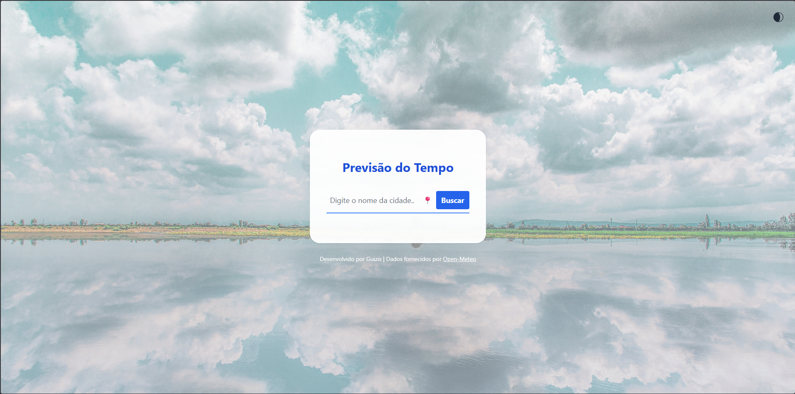
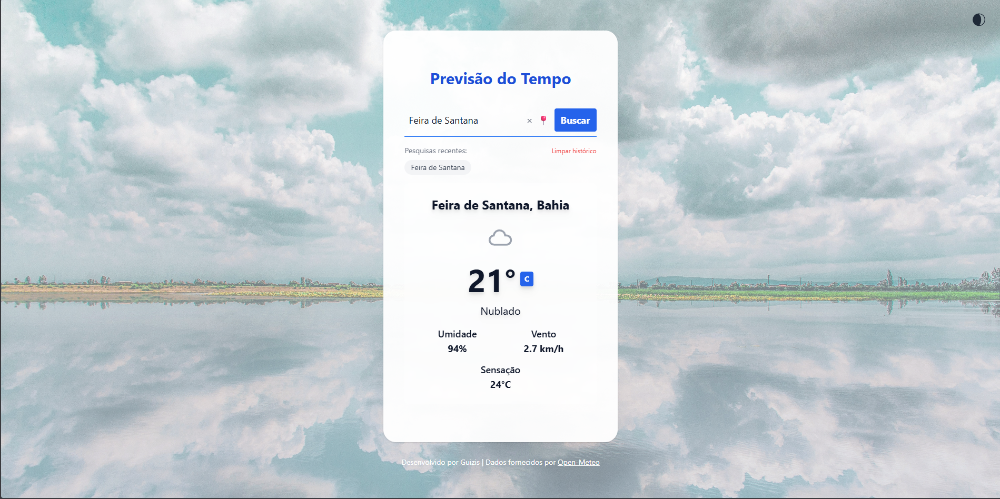

# Tá Uma Lua Pra Cada 🌙

Uma aplicação web para consultar clima e previsões de forma rápida, com busca por cidade e histórico de pesquisas.

**Live Demo:** https://ta-uma-lua-pra-cada.vercel.app/
**Stack:** React + TypeScript + Vite (e APIs de clima/geocoding)

---

## ✨ Funcionalidades
- Buscar clima por cidade
- Exibir condições atuais e previsão
- Histórico de cidades pesquisadas
- Tratamento de estados: loading / erro / vazio

---

## 🖼️ Preview





---

## 🧭 Como funciona (arquitetura rápida)
Fluxo principal:
1. Usuário digita uma cidade
2. App resolve coordenadas (Geocoding)
3. App consulta a API de clima com latitude/longitude
4. UI renderiza dados + salva no histórico

Estrutura :
.
├── docs/
│   └── screenshots/        # Imagens usadas no README
├── public/                 # Arquivos públicos (ícones, imagens)
├── src/
│   ├── assets/             # Imagens e assets visuais
│   ├── components/         # Componentes reutilizáveis da UI
│   │   ├── ErrorBoundary.jsx
│   │   ├── Footer.jsx
│   │   ├── LoadingSpinner.jsx
│   │   ├── RecentSearches.jsx
│   │   ├── SearchForm.jsx
│   │   ├── WeatherCard.jsx
│   │   └── WeatherIcon.jsx
│   ├── App.jsx             # Componente raiz da aplicação
│   ├── main.jsx            # Ponto de entrada (React + Vite)
│   └── index.css           # Estilos globais
├── index.html               # HTML base
├── vite.config.js           # Configuração do Vite
├── tailwind.config.js       # Configuração do Tailwind CSS
└── package.json


---

## 🚀 Como rodar localmente
### Pré-requisitos
- Node.js (recomendado LTS)

### Instalação
```bash
git clone https://github.com/GuilhermeFreitasOliver/TaUmaLuaPraCada.git
cd TaUmaLuaPraCada
npm install
````

### Variáveis de ambiente

Crie um `.env` baseado no `.env.example`:

```bash
cp .env.example .env
```

### Rodar

```bash
npm run dev
```

---

## 🗺️ Roadmap

* [ ] Favoritar cidades
* [ ] Cache de resultados (localStorage) por 10–30 min
* [ ] Modo escuro
* [ ] Melhorias de acessibilidade (aria-live, foco)

---

## 📄 Licença

Este projeto está sob a licença MIT.

```
